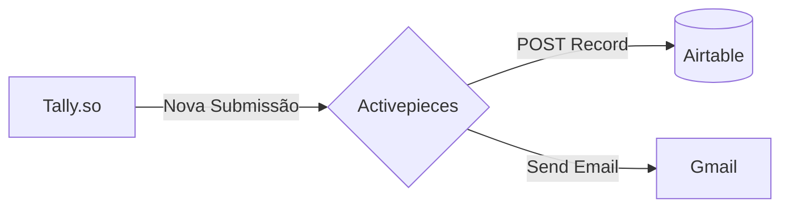

# 🛠️ Sistema de Help Desk Automatizado (No-Code)

Um sistema completo e automatizado de atendimento ao usuário (Help Desk) construído inteiramente com ferramentas no-code. Este projeto foi desenhado para otimizar fluxos operacionais, garantindo que os chamados sejam registrados, roteados e respondidos em segundos, sem intervenção manual.

## 🎯 Objetivo do Projeto

Demonstrar a construção de uma arquitetura de dados e automação ágil, integrando formulários dinâmicos a bancos de dados relacionais e sistemas de mensageria. Ideal para validar processos operacionais e MVPs (Minimum Viable Products) dentro de ecossistemas tecnológicos dinâmicos, liberando tempo para focar no desenvolvimento das aplicações centrais.

## 🧰 Stack Tecnológica (Ferramentas)

* **[Tally.so](https://tally.so/):** Interface do usuário (Frontend). Formulário com lógica condicional para triagem dos chamados (TI vs. Design).
* **[Airtable](https://airtable.com/):** Banco de dados relacional e gestão de fluxo (Backend/Dashboard). Utiliza visualizações em Grid, Kanban e Calendário.
* **[Activepieces](https://www.activepieces.com/):** Middleware de automação (Engine). Responsável por escutar os webhooks e orquestrar as APIs das plataformas envolvidas.
* **Gmail API:** Sistema de mensageria para notificações transacionais.

## 🔄 Arquitetura e Fluxo de Dados

O sistema opera sob uma arquitetura orientada a eventos (Event-Driven):

1. **Gatilho (Trigger):** O usuário preenche o formulário no Tally.so.
2. **Processamento:** O Activepieces captura a submissão via Webhook/API.
3. **Ação 1 (Persistência):** O Activepieces mapeia os dados do JSON recebido e cria um novo registro formatado na base do Airtable.
4. **Ação 2 (Notificação):** Imediatamente após a inserção no banco, o Activepieces dispara um e-mail de confirmação para o endereço fornecido pelo usuário via Gmail.

## 📋 Estrutura do Banco de Dados (Airtable)

A tabela principal (`Chamados Abertos`) está configurada com os seguintes campos:

| Campo | Tipo de Dado (Airtable Type) | Descrição |
| --- | --- | --- |
| **Nome** | Single Line Text | Nome do solicitante |
| **E-mail** | Email | Contato do solicitante |
| **Tipo** | Single Line Text | Setor de direcionamento (ex: TI, Design) |
| **Descrição** | Long Text | Detalhamento do problema |
| **Prioridade** | Single Line Text | Baixa, Média ou Alta |
| **Status** | Single Select | Recebido, Em Processo, Finalizado |
| **Data_Abertura** | Date | Gerado automaticamente via sistema |

## 🚀 Como Replicar este Projeto

Para implementar este fluxo, você precisará de contas ativas nas três plataformas:

1. **Tally.so:** Crie um formulário com os campos citados e adicione blocos de **Conditional Logic** para exibir perguntas específicas com base no setor escolhido. Gere uma *API Key* nas configurações.
2. **Airtable:** Crie um Workspace e uma Base vazia. Adicione os campos listados acima. Acesse a área de desenvolvedor para gerar um **Personal Access Token** com permissões de `data.records:read`, `data.records:write` e `schema.bases:read`.
3. **Activepieces:** Crie um novo fluxo (*Start from scratch*). Conecte o Tally como Trigger inserindo a sua API Key. Adicione o Airtable como Action, inserindo o Token e mapeando os campos. Adicione o Gmail como Action final, vinculando sua conta Google e parametrizando o corpo do e-mail.
